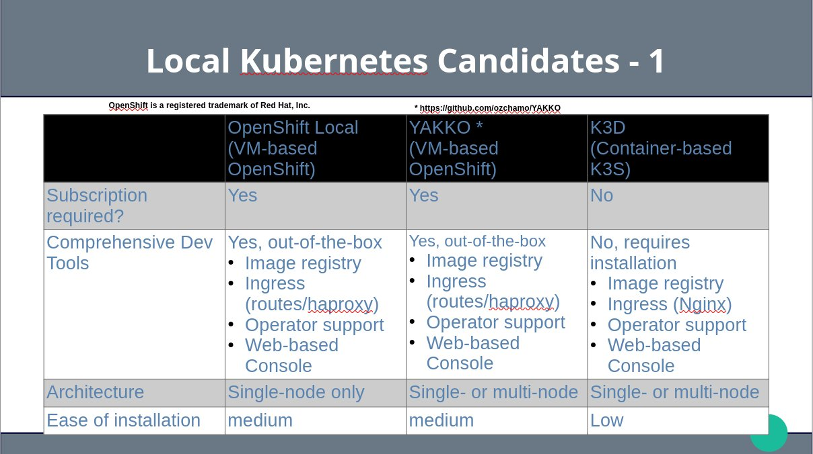
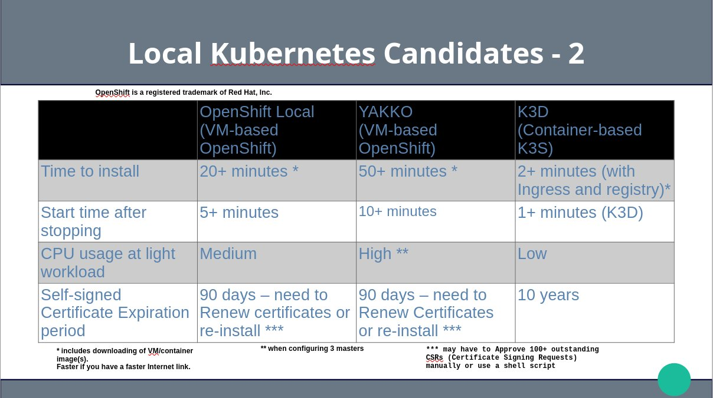
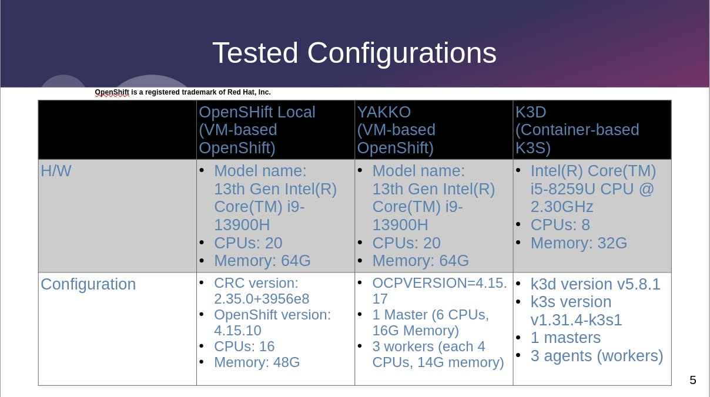
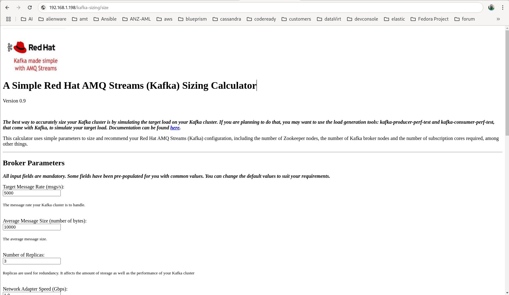

# Kubernetes for Local Development

Local K8S Development Environment: the operative word here being ‘LOCAL’,meaning that we are going to install the development environment on our laptop and not on a server or in the cloud.
There are many K8S favours to choose from. Which one do we use? Today I am going to compare 3 and choose one for my development environment:

1. OpenShift Local – a VM-based single-node OpenShift cluster from Red Hat
2. YAKKO – YAKKO is a tool (shell scripts) for building a VM-based single or multi-node OpenShift cluster. When you run it, it asks you a number of questions and builds a OpenShift cluster for you based on your answers. I already mentioned OpenShift a couple of times. There are reasons for this which I shall go into momentarily. In my opinion, using YAKKO is the easiest way to build a single-node or multi-node OpenShift cluster on VMs
3. K3D – k3d is a lightweight wrapper to run k3s in docker. It can create either a single or multi-node cluster. It is easy and quick to setup.

Let me show you the pros and cons of each and let you know which one I've chosen to be my development environment.

## 1.0 Candidate Comparison
The pros and cons of each candidate can be summarised in the following slides:

* OpenShift has the most useful features out-of-the-box although most of these features can be installed on K3D as well. Just that it requires additional effort after creating a K3D cluster.
* OpenShift requires a subscription while K3d does not.

* It can be seen in the slide that K3D is the quickest to install and startup after stopping.
* I try to be clever and initially installed a 3-master OpenShift cluster without worker nodes. My idea was that one gets HA with multi-masters and that the masters can be used to run workload too. It turns out that the 3 masters consume up to a total of 40% CPU (observed using htop) on the 20 CPU 13 Gen INTEL I9-13900H machine just running my Kafka-sizing Spring Boot application. I, later, rebuilt built a 1-master-3 worker clsuter and it reduced the CPU consumption. In contrast, the same kafka-sizing app running a 1-master-3-agent K3d cluster on an older INTEL 8-CPU i5-8259U consumes less than 10% of the total CPU.
* the deal-breaker for me is that OpenShift Local and YAKKO-built OpenShift cluster's 90-day certificate expiration. One may need to approve 100+ outstanding CSRs (Certificate Signing Requests) manually or using a shell script to make it work. I do not consider myself an OpenShift expert. There may be ways to resolve this which I am not aware of. Murphy's Law dictates that the certificate expiration always occurs when you needed you K8S cluster the most. In fact I encounteres that problem at least a couple of times.

My suggestions are:
1. If you don't mind renewing certificates and using a single-node K8S cluster, OpenShift Local may be your best bet as it is more feature-rich than K3D out-of-the-box.
2. If you like to experiment and don't mind some extra work to add the missing features to your K3D cluster, you will get almost the same features of OpenShift Local but running your cluster in multi-node instead of single-node. A K3D cluster appears to be more efficient than an OpenShift Local or YAKKO-built multi-node OpenShift cluster due to using containers instead of VMs.

My choice is K3D for experimentation and development. It is quick to start and install. I can destroy the cluster and rebuild it in a couple of minutes if necessary. This, paired with GitOps using helm/kustomize/ArgoCO, means that I can recreate a cluster and its workload quite quickly using K3D.

## 2.0 Installing a Multi-node K3D Cluster
In this section, I am going to build a 1-master, 3-agents (workers in OpenShift terms) K3D cluster.
I created shell scripts to make the installation painless. They are:
1. installPrerequites.sh – installs the prerequistes to run the  createDevCluster.sh script. The prerequisites include:
    * docker
    * k3d
    * helm
    * kubectl
 Invoke without command line arguments:
<pre>
# Change to the local-k8s-dev/scripts directory and run:
./installPrerequites.sh
</pre>
2. createDevCluster.sh – installs the following:
    * an image registry
    * a K3D/K3S cluster consists of 3 masters and 3 agents (workers)
    * The ingress-nignix for ingress
 
Invoke using command line argument: 
<pre>
./createDevCluster.sh nameOfCluster hostIP
</pre>
where <B>nameOfCluster</B> is what you want to call your cluster. It creates a folder named nameOfCluster in your home directory. <B>hostIP</B> is the IP Address of your host running the cluster. It associates the hostIP to the Kubernetes API server's generated HTTPS certificate. You can use the hostIp to access your services.

3. setDefaultNamespace.sh – creates a namespace and makes it the default namespace so that you do not have to use the -n option to specify the namespace to deploy resources.
 
Invoke using command line argument: 
<pre>
./setDefaultNamespace.sh namespaceName
</pre>
where <B>namespaceName</B> is the name of the namespace to create and set as the default namespace.

## 3.0 Deploying an Application using Helm

Before you do the following, make sure your cluster is up and running and that you have run the setDefaultNamespace.sh script to create a 'kafka-sizing' namespace and made it the default as in:
<pre>
./setDefaultNamespace.sh kafka-sizing
</pre>
  Change to the 'local-k8s-dev/helm-kafka-sizing' directory and deploy the kafka-sizing application and a mysql database with a schema initialized by a configmap using the helm-kafka-sizing helm chart.
<pre>
Helm install kafka-sizing . --values=values-dev.yaml
</pre>
The Kafka-sizing Spring Boot application can be accessed from a browser by entering the URL as follows:
<pre>
http(s)://hostIP/kafka-sizing/size
</pre>

The details will be explained in subsequent updates to this document and another video.

## 4.0 Using Helm/Kustomize/ArgoCD

## 5.0 Using K8S Operators

## Conclusions